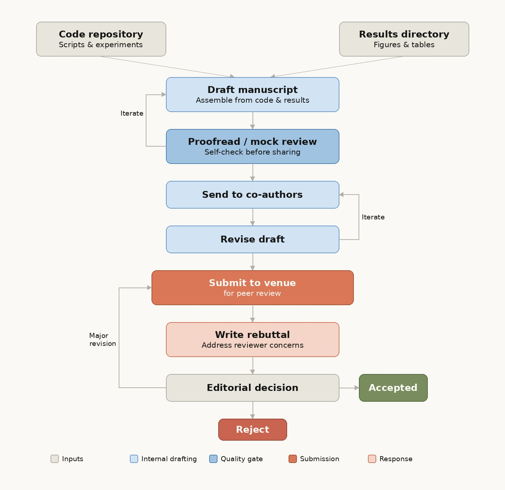

# Academic Writing Skills

Expert-level guidance for writing academic papers in engineering and computer science. Five specialized skills cover the full paper lifecycle — from drafting a paper out of a research repo to responding to reviewer feedback.

## Typical Workflow

The skills map to distinct phases of the paper lifecycle:



| Phase                       | Skill                      | What happens                                                                                         |
| --------------------------- | -------------------------- | ---------------------------------------------------------------------------------------------------- |
| **Draft manuscript**        | `draft-from-code`          | Reads your repo and produces a full LaTeX draft, consulting `writing-guide.md` for each section      |
| **Proofread / mock review** | `proofread`, `peer-review` | Self-check before sharing — multi-pass polish and simulated review to catch issues early (iterate back to draft as needed) |
| **Send to co-authors**      | —                          | Share the polished draft for feedback                                                                |
| **Revise draft**            | `revise`                   | Incorporates co-author feedback and resolves TODOs using `writing-guide.md` (iterate with co-authors until ready) |
| **Submit to venue**         | —                          | Submit for peer review; verify against `checklists.md`                                               |
| **Write rebuttal**          | `rebuttal`                 | Crafts point-by-point responses using `reviewer-guidelines.md` to understand reviewer perspective    |
| **Editorial decision**      | `revise`                   | If major revision, loop back to submit with revised paper                                            |

## Installation

Add the marketplace and install the plugin in Claude Code:

```
/plugin marketplace add jasonbian97/jason-cc-skills
/plugin install academic-writing@jason-cc-skills
```

After installation, all five skills are available as slash commands:

- `/academic-writing:draft-from-code`
- `/academic-writing:proofread`
- `/academic-writing:rebuttal`
- `/academic-writing:revise`
- `/academic-writing:peer-review`

**Updating: **

To pull the latest version, re-run the install command:

```
/plugin install academic-writing@jason-cc-skills
```

## Skills

### 1. Draft from Code (`/draft-from-code`)

Generates a complete paper draft from a research repository. Explores your code, configs, results, and existing notes, then writes full LaTeX sections with real numbers from your experiments.

**When to use:** You have a research repo with results and want to turn it into a paper. Examples: "help me write this up", "draft the experiments section", "turn these results into a paper".

### 2. Proofread (`/proofread`)

Multi-pass proofreading for style, clarity, grammar, and LaTeX correctness. Five passes cover structure & flow, sentence-level clarity, word choice, grammar & formatting, and LaTeX-specific issues.

**When to use:** Your draft is content-complete and needs polishing before submission. Examples: "clean this up", "check my writing", "proofread this section".

### 3. Rebuttal (`/rebuttal`)

Crafts structured author responses to reviewer feedback. Categorizes each concern, prioritizes responses, and drafts point-by-point rebuttals with the Restate → Response → Action format.

**When to use:** You received reviews and need to write a rebuttal or author response. Examples: "help me respond to these reviews", "the reviewers said X".

### 4. Revise (`/revise`)

Incorporates co-author feedback, resolves TODO comments, and restructures sections. Handles everything from in-place sentence fixes to full section rewrites and venue format conversions.

**When to use:** You have feedback to address or TODOs to resolve. Examples: "my advisor says this section needs work", "fix these TODOs", "reformat for ICML".

### 5. Peer Review (`/peer-review`)

Simulates peer review before submission. Scores your paper on quality, clarity, significance, and originality, identifies weaknesses, and gives concrete suggestions. Supports a default constructive mode and an adversarial stress-test mode.

**When to use:** You want to check your paper for weaknesses before submitting. Examples: "what would reviewers think", "is this ready to submit", "review my paper".

## Architecture

### Directory Structure

```
academic-writing/
├── .claude-plugin/
│   └── plugin.json              # Plugin metadata (name, version, skill registry)
├── references/                   # Shared reference documents
│   ├── writing-guide.md         # Master writing philosophy & section-by-section rules
│   ├── reviewer-guidelines.md   # How reviewers evaluate papers (4 dimensions)
│   └── checklists.md            # Pre-submission, reproducibility, ethics checklists
└── skills/
    ├── draft-from-code/SKILL.md
    ├── proofread/SKILL.md
    ├── rebuttal/SKILL.md
    ├── revise/SKILL.md
    └── peer-review/SKILL.md
```

### Reference Documents

The three files under `references/` are the shared knowledge base. Skills read specific references at runtime rather than duplicating guidance.

| Reference                | Purpose                                                                                              | Used by                            |
| ------------------------ | ---------------------------------------------------------------------------------------------------- | ---------------------------------- |
| `writing-guide.md`       | Section-by-section writing rules, 7 reader-expectation principles, grammar/formatting checklists, citation workflow | draft-from-code, proofread, revise |
| `reviewer-guidelines.md` | Evaluation dimensions (quality, clarity, significance, originality), Dennett's rules, common reviewer concerns | rebuttal, peer-review              |
| `checklists.md`          | Pre-submission, reproducibility, ethics, and final-check checklists                                  | All skills (implicitly)            |

### Dependency Graph

```
                    references/
        ┌──────────────┴──────────────┐
        │                             │
   writing-guide.md          reviewer-guidelines.md
        │                             │
   ┌────┼────┐                   ┌────┴────┐
   │    │    │                   │         │
   v    v    v                   v         v
 draft  proof revise         rebuttal  peer-review
 from   read
 code

        checklists.md ← referenced implicitly by all skills
```